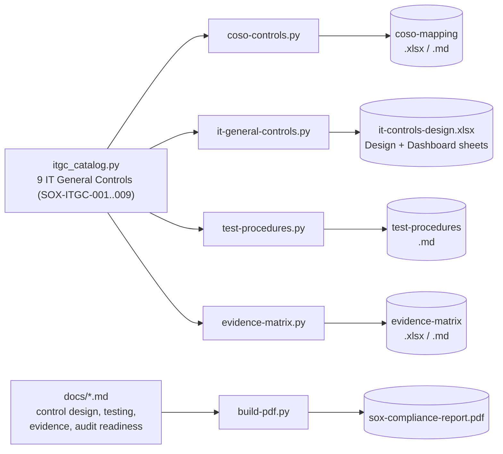
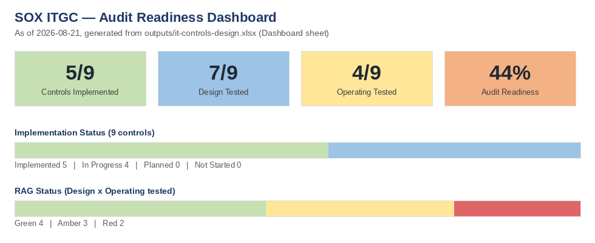
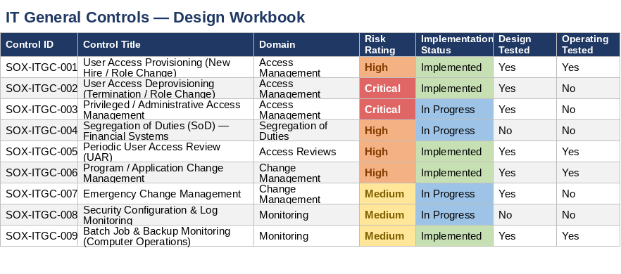
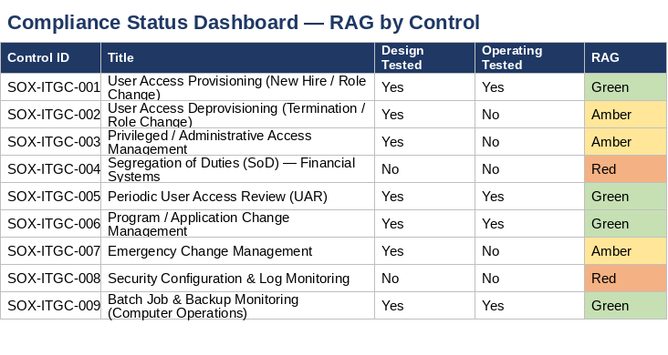
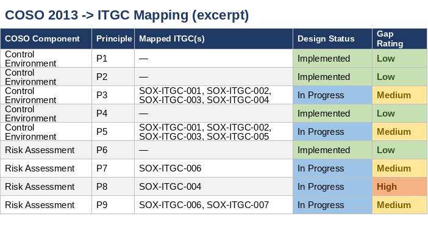
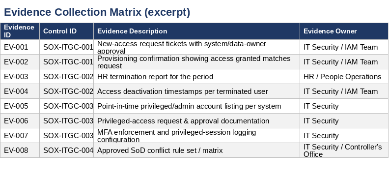
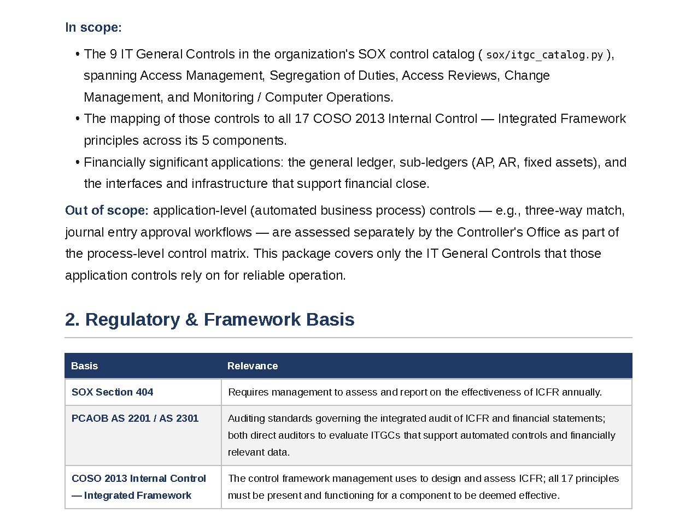

# SOX Compliance Package


Portfolio project: a SOX Section 404 IT General Control (ITGC) design package built as code.
Instead of hand-maintained spreadsheets, the COSO 2013 framework mapping, ITGC design
workbook + compliance dashboard, test procedures manual, and evidence collection matrix are
all generated by Python scripts from one shared control catalog — so a control ID stays
traceable across every deliverable without drift.

## How it fits together



Every deliverable cites the same `SOX-ITGC-0##` IDs, so a control's risk rating, test
status, and evidence requirements stay consistent everywhere it's referenced.

## What it looks like

**Audit readiness dashboard** — implementation, testing, and RAG status, generated straight from the workbook's own Dashboard sheet



<table>
<tr>
<td width="50%">

**ITGC design workbook** — all 9 controls, risk-rated and status-tracked



</td>
<td width="50%">

**Compliance dashboard (RAG)** — design x operating test coverage per control



</td>
</tr>
<tr>
<td width="50%">

**COSO 2013 -> ITGC mapping** — every principle traced to a control or entity-level note



</td>
<td width="50%">

**Evidence collection matrix** — what to pull, and from where, per control



</td>
</tr>
</table>

**Compliance report, generated straight from Markdown to PDF** — scope, regulatory basis, and framework mapping in one auditor-ready document



## Structure

```
sox/
  itgc_catalog.py             # single source of truth: 9 IT General Controls (SOX-ITGC-001..009)
  xlsx_style.py                # shared openpyxl styling (banners, risk/status colors, tables)
  coso-controls.py             # COSO 2013 (5 components, 17 principles) -> ITGC mapping
  it-general-controls.py       # ITGC design workbook + compliance status dashboard
  test-procedures.py           # test objective/steps/expected results per control
  evidence-matrix.py           # evidence collection matrix (what/how/owner/retention)

docs/
  SOX-Control-Design.md            # main control design document
  Testing-Procedures.md            # testing methodology, sampling standards, cadence
  Evidence-Collection.md           # evidence collection guidance and retention policy
  Audit-Readiness.md               # current readiness checklist and open items
  build-pdf.py                     # renders the 4 docs above into outputs/sox-compliance-report.pdf

templates/
  generate-control-template.py     # generates a blank, reusable ITGC control-design workbook
  control-design-template.xlsx
  test-procedure-template.md       # blank per-control, per-period test workpaper

outputs/                    # generated — see "Build" below
```

## Build

```bash
pip install -r requirements.txt

python3 sox/coso-controls.py
python3 sox/it-general-controls.py
python3 sox/test-procedures.py
python3 sox/evidence-matrix.py
python3 templates/generate-control-template.py
python3 docs/build-pdf.py
```

Each `sox/*.py` script writes to `outputs/`. `docs/build-pdf.py` combines the four `docs/*.md`
files into a single `outputs/sox-compliance-report.pdf` using `markdown` + `weasyprint` — no
system `pandoc`/LaTeX install required. The docs are also plain, pandoc-compatible Markdown if
you prefer that path, e.g.:

```bash
pandoc docs/SOX-Control-Design.md -o outputs/sox-control-design.pdf
```

## Current baseline (2026-08-21)

- 9 IT General Controls across Access Management, Segregation of Duties, Access Reviews,
  Change Management, and Monitoring
- All 17 COSO 2013 principles addressed; 12 mapped directly to an ITGC, 5 tracked as
  entity-level controls
- 5 of 9 controls implemented; 7 of 9 design-effectiveness tested; 4 of 9 (44%)
  operating-effectiveness tested — see `outputs/it-controls-design.xlsx` Dashboard sheet
- 9 test procedures covering all controls (`outputs/test-procedures.md`)
- 20 evidence artifacts mapped across all 9 controls, 7-year retention
  (`outputs/evidence-matrix.xlsx`)

## Notes on fidelity

COSO 2013 principle text is reproduced from training knowledge for portfolio/illustrative
purposes — validate exact current wording against the COSO Framework publication before any
external/compliance use. Control names, risk ratings, and status values are illustrative for
a representative financially significant IT environment (ERP, general ledger, sub-ledgers);
adapt the catalog in `sox/itgc_catalog.py` to your actual in-scope systems before real use.
